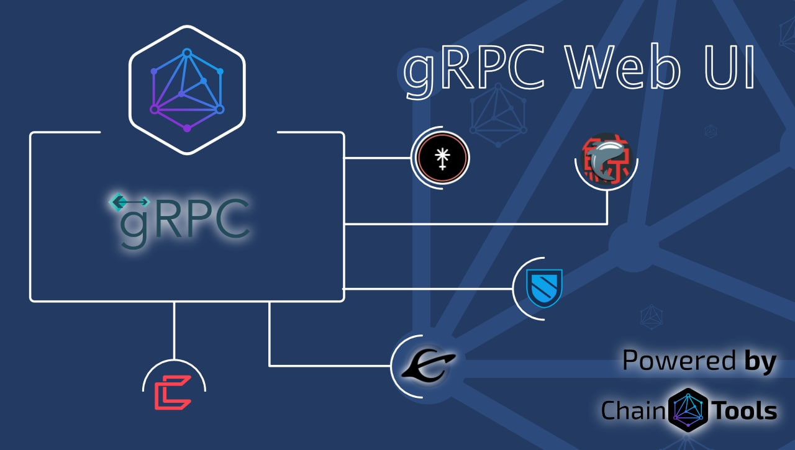
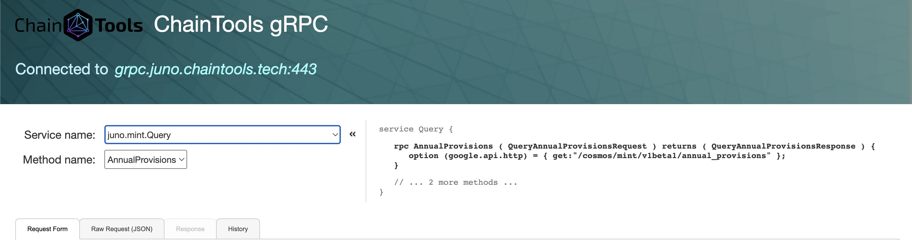
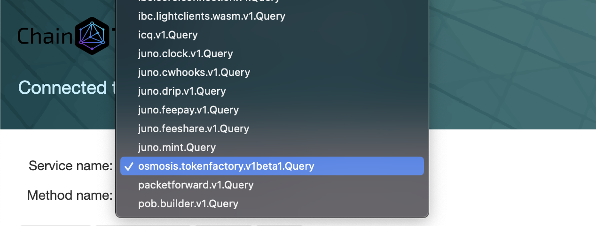
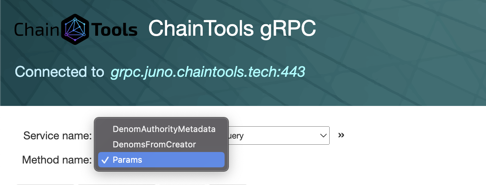
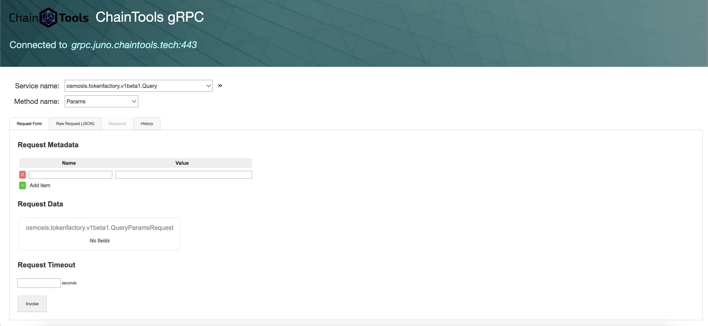
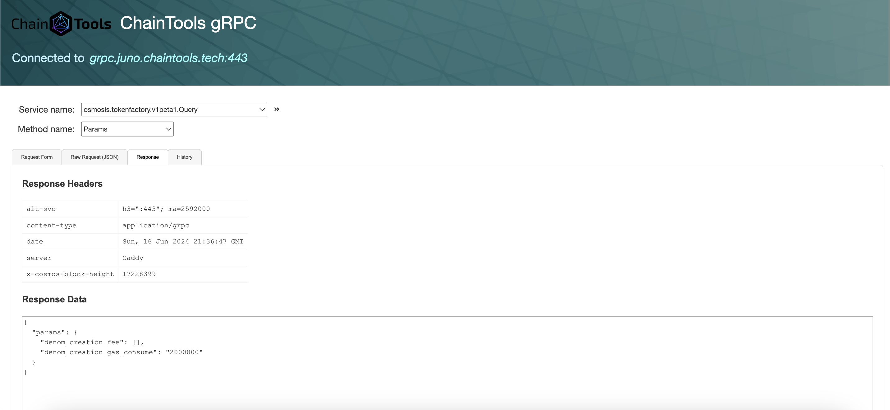

## Introduction

## gRPC Web UI - BETA 

The **gRPC Web UI** is a tool for querying gRPC. Currently in **BETA**, this web-based user interface allows you to interact with gRPC servers directly from browser. Similar to Postman, but specifically designed for gRPC APIs instead of REST.

## What is gRPCui?

gRPCui is a command-line tool that provides a web-based user interface for gRPC. It allows to:
- Query gRPC servers
- Interact with gRPC APIs
- Visualize responses in a user-friendly format

## Features

`grpcui` supports all RPC methods, including streaming. However, you must construct the entire stream of request messages at once, and it renders the entire response stream at once, unlike `grpcurl` which allows bidirectional interaction.

- `grpcui` supports plain-text and TLS servers, with various TLS configuration options, including mutual TLS with client certificates.

- Upon issuing an RPC, the web UI displays all gRPC response metadata, including headers and trailers, and presents the response body in a human-readable HTML table.

## How to Use gRPCui

1. Access the tool at [https://juno.grpcui.chaintools.host/](https://juno.grpcui.chaintools.host/) or install the tool from [grpcui](https://github.com/fullstorydev/grpcui/).

To be an example, let's query tokenfactory module params. For this, choose osmosis.tokenfactory.v1beta1.Query service name.

Then, choose Params method name:

2. Use the interface to query the server and visualize the responses.

And, the response:

## Credits

[ChainTools](https://chaintools.tech).

- **@fullstorydev**: For the base code.
- **@sascha1337**: For their work in getting this tool up and running.
- **@qf3l3k_tech**: For connecting to servers.
