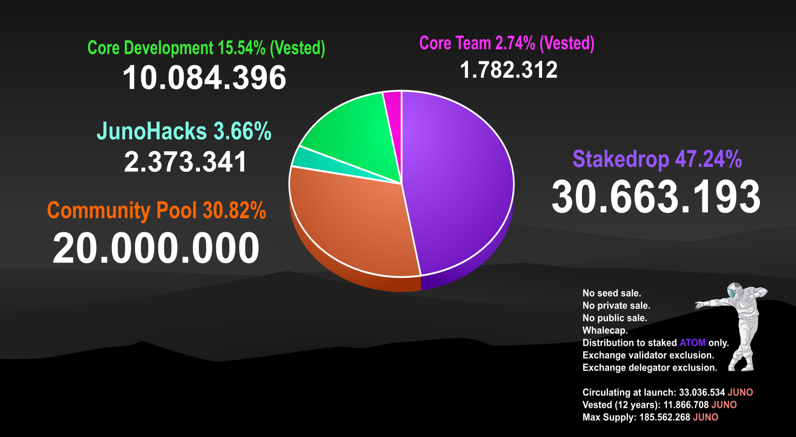

# Asset \(JUNO\)

JUNO, the native asset of the network carries a variety of use cases within the ecosystem, including **securing the proof of stake network**, **key to on-chain governance**, act as **transport fuel for all interoperable smart contracts** deployed in the ecosystem, **collateral** in various smart contract usecases and **work token** to capture value from dapps built on top of JUNO.

  
**Genesis Supply Breakdown**

⚪️ Community **Stakedrop**: 30.663.193 $JUNO

⚪️ **Community Pool:** 20.000.000 $JUNO

⚪️ Smart Contract **Challenges**: 2.373.341 $JUNO

⚪️ **Core** **Development Reserve** \(Vested 12 years ie non-circulating\)**:** 10.084.396 $JUNO

⚪️ **Core Team** \(Vested 12 years ie. non-circulating\): 1.782.312 $JUNO

  
✅ Circulating Supply at Genesis: 33.036.534 $JUNO 

✅ Vested at Genesis \(non-circulating\): 11.866.708 $JUNO 

✅ Locked in Community Pool \(non-circulating\): 20.000.000 $JUNO 

✅ Maximum supply \(Reached in 12 years/year 2033\): 185.562.268 $JUNO

