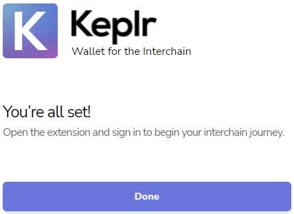

# Keplr Browser Extension

## Before we Start

Please note the following important announcements:


**Keplr extension is only officially supported by the Google Chrome browser.**

There is a Brave extension available but may lack some features of the Chrome version. \
There is no official Keplr extension for Firefox. Be aware of scammers.



**Please be aware that you must never provide your "mnemonic" (aka "private key" or "seed phrase") to anyone, EVER. No individual from the Juno team will EVER request you provide provide this and it is not required for any technical support purpose whatsoever.**


This tutorial assumes you are using the Chrome browser.

## **Install Keplr Browser Extension**

1. Follow this [link ](https://chrome.google.com/webstore/detail/keplr/dmkamcknogkgcdfhhbddcghachkejeap?hl=en)to the official Keplr browser extension on the chrome web store and click on the **Add to Chrome** button.

.png>)

2\. A dialogue window will appear requesting permission to add "Keplr". Click the **Add extension** button.

.png>)

3\. By default, the extension icon will be nested under the extensions icon on the toolbar in the top right of the browser. Click the extensions icon and then click the pin icon to make Keplr visible in the toolbar.

.png>)

4\. The Keplr extension can now be interacted with by clicking on the Keplr icon.

.png>)

## Add Accounts

There are two ways to initiate adding an account to Keplr extension. The first method is used if you have not already added any accounts to Keplr. The second method is used when you are adding additional accounts to Keplr.

**Method 1 (no existing accounts)**

Click the Keplr extension icon. A new browser tab will appear.

**Method 2 (existing account already added)**

Click the Keplr extension icon. After the Keplr wallet window opens, click the silhouette in the top right hand corner.

.png>)

Another window will appear with a list of accounts. Click **+ Add Account** to add or create a new account.

.png>)

You now have 3 options to add and import accounts to the Keplr extension:

* [Create a new account](keplr-browser-extension.md#create-new-account),
* [Import an existing account](keplr-browser-extension.md#import-an-existing-account), or
* [Import ledger](keplr-browser-extension.md#import-ledger).

.png>)


**For people who have stakedrop** ([http://stakedrop.junochain.com](http://stakedrop.junochain.com) to confirm):

If you do not already have the account associated with your stakedrop loaded into your Keplr wallet, please proceed to [Import existing account](keplr-browser-extension.md#import-an-existing-account) and use the "Mnemonic Seed" associated with your Cosmos (ATOM) account that is eligible for the stakedrop. Or, if your Cosmos account was secured by a ledger hardware wallet, please proceed to[ Import ledger](keplr-browser-extension.md#import-ledger).


### Create new account

1. After clicking on the **Create new account** button you will be presented with form with a field for you to enter your "mnemonic seed" as well as fields for your "Account name", "New Password" and "Confirm password".


**Before continuing:** Write down your "Mnemonic Seed" on a piece of paper. Store these words in a secure place and **NEVER** provide them to anyone. This phrase is the only way to recover your account if you lose access to the Keplr extension and it is the **ONLY** way to migrate you account to another wallet. Anyone who has this Mnemonic Seed can access and withdraw your crypto tokens.

**DO NOT:** Take screenshots or store these words digitally.


.png>)

2\. Enter your chosen account name and password for the account, and then click the **Next** button.

.png>)

3\. You will be prompted to enter your mnemonic seed by clicking the words in the correct order from the previous screen. Select the words in order and click the **Register** button when it is unlocked by successfully selecting the words in order.

.png>)

4\. The following screen will let you know "You're all set!". Click the **Done** button to finish.

5\. Your account is now accessible by clicking on the Keplr extension icon in the toolbar.

 (1) (1) (1) (1).png>)

### Import an existing account

1. After clicking on the **Import existing account** button, you will be presented with a form where you can "Input your seed" as well as fields for your "Account name", "New Password" and "Confirm password". Enter your seed phrase (mnemonic seed), choose an account name for the wallet and create a new password. Click the **Next** button when done.

.png>)

2\. The following screen will let you know "You're all set!". Click the **Done** button to finish.

.png>)

3\. Your account is now accessible by clicking on the Keplr extension icon in the toolbar.

 (1) (1) (1).png>)

### Import ledger

The following ledger tutorial assumes that you have followed the setup instructions for your ledger device and have installed the **cosmos app** on your ledger device. If you have not already completed this setup, please see:

* [Setting up ledger device](https://support.ledger.com/hc/en-us/articles/360000613793-Set-up-your-Ledger-Nano-S?docs=true)
* [Installing apps on a ledger device](https://support.ledger.com/hc/en-us/articles/4404382258961?docs=true)

Now that your ledger device has been setup, we can continue with the tutorial.

1. **Connect your ledger** device to your computer via a USB cable.
2. **Enter your pin** number into the ledger device to log in.
3. **Open the cosmos app** on your ledger device.
4. Now click **Import ledger**, you will be presented with a form with fields for your "Account name", "New Password" and "Confirm password".

.png>)

5\. Enter your chosen account name as well as a password. Click **Next** to continue.

.png>)

If this is the first time you have used a ledger with the browser, you may be presented with the following popup. **Follow the steps in the popup** and click **Next** to continue.

.png>)

You will be presented with another popup window. Select the desired device from the list and click **Connect** to continue.

.png>)

6\.  The following screen will let you know "You're all set!". Click the **Done** button to finish.

.png>)

7\. Your account is now accessible by clicking on the Keplr extension icon in the toolbar.

.png>)

## Switching Between Accounts

If you have multiple accounts attached to your Keplr browser extension, you may need to switch between them from time to time.

To change accounts:

1. Click the Keplr extension icon, then click the silhouette in the top right hand corner.&#x20;

&#x20;

.png>)

2\. A window will be shown with all of you accounts attached to Keplr. You can choose your desired account by clicking on it.

.png>)

