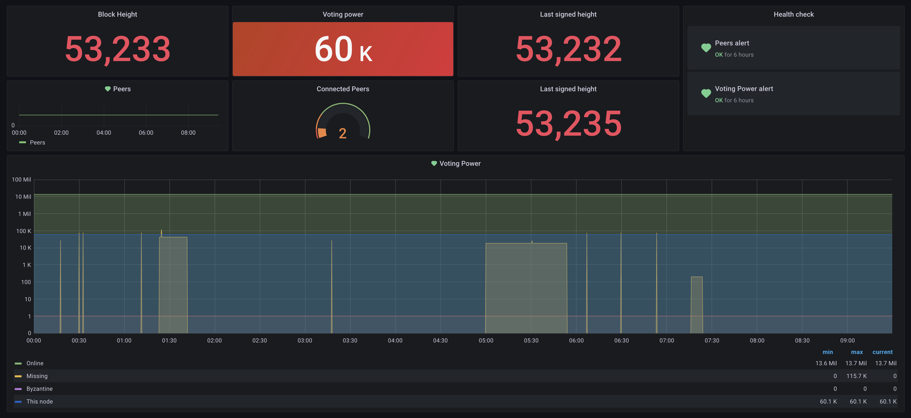

# Mainnet Setup and Tooling

All of the hard work of the community has paid off, and now it's time to take the network live. Preparing your validator for mainnet involves a few extra considerations. They are detailed below, but a sensible checklist is:

* How will you handle chain upgrades?
  * consider: **Cosmovisor**
* How will you know your node is up?
  * consider: **Monitoring and alerts**
* How will you mitigate DDOS attacks?
  * consider: **Sentry Nodes**
* How much storage will you need?

Answering these questions can be daunting, so there is some advice below.

### Chain upgrades

In order to streamline chain upgrades and minimise downtime, you may want to set up [cosmovisor](https://docs.cosmos.network/master/run-node/cosmovisor.html) to manage your node. A [guide for this is provided](setting-up-cosmovisor.md) in the Juno docs.

### Backups

Backups of chain state are possible using the commands specified [here](https://hub.cosmos.network/main/hub-tutorials/join-mainnet.html#exporting-state). If you are using a recent version of Cosmovisor, then the default configuration is that a state backup will be created before upgrades are applied. [This can be turned off using environment flags](https://docs.cosmos.network/master/run-node/cosmovisor.html#command-line-arguments-and-environment-variables).

### Alerting and monitoring

Alerting and monitoring is desirable as well - you are encouraged to explore solutions and find one that works for your setup. Prometheus is available out-of-the box, and there are a variety of open-source tools. Recommended reading:

**Alerting:**

* Tenderduty: [https://github.com/blockpane/tenderduty](https://github.com/blockpane/tenderduty)
* PANIC: [https://github.com/SimplyVC/panic\_cosmos](https://github.com/SimplyVC/panic\_cosmos)

**Monitoring:**

* \*\*\*\*[https://medium.com/solar-labs-team/cosmos-how-to-monitoring-your-validator-892a46298722](https://medium.com/solar-labs-team/cosmos-how-to-monitoring-your-validator-892a46298722)
* [https://medium.com/simply-vc/cosmos-monitoring-and-alerting-for-validators-8e3f016c9567](https://medium.com/simply-vc/cosmos-monitoring-and-alerting-for-validators-8e3f016c9567)
* [https://chainflow.io/cosmos-validator-mission-control/](https://chainflow.io/cosmos-validator-mission-control/)
* [https://medium.com/cypher-core/cosmos-how-to-set-up-your-own-network-monitoring-dashboard-fe49c63a8271](https://medium.com/cypher-core/cosmos-how-to-set-up-your-own-network-monitoring-dashboard-fe49c63a8271)

#### Simple setup using Grafana Cloud

Using only the raw metrics endpoint provided by `junod` you can get a working dashboard and alerting setup using Grafana Cloud. This means you don't have to run Grafana on the instance.

1. First, in `config.toml` enable Prometheus. The default metrics port will be `26660`
2. Download Prometheus - this is needed to ship logs to Grafana Cloud.
3. Create a `prometheus.yml` file with your [Grafana Cloud credentials](https://grafana.com/docs/grafana-cloud/reference/create-api-key/) in the Prometheus folder. You can get these via the Grafana UI. Click 'details' on the Prometheus card:

```
global:
  scrape_interval: 15s

scrape_configs:
  - job_name: cosmops
    static_configs:
    - targets: ['localhost:26660']
      labels:
        group: 'cosmops'

remote_write:
  - url: https://your-grafana-cloud-endpoint/api/prom/push
    basic_auth:
      username: ID_HERE
      password: "API KEY HERE"
```

3\. Set up a service file, with `sudo nano /etc/systemd/system/prometheus.service`, replacing `<your-user>` and `<prometheus-folder>` with the location of Prometheus. This sets the Prometheus port to `6666`

```
[Unit]
Description=prometheus
After=network-online.target

[Service]
User=<your-user>
ExecStart=/home/<your-user>/<prometheus-folder>/prometheus --config.file=/home/<your-user>/<prometheus-folder>/prometheus.yml --web.listen-address=:6666 --storage.tsdb.path=/home/<your-user>/<prometheus-folder>/data
Restart=always
RestartSec=3
LimitNOFILE=4096

[Install]
WantedBy=multi-user.target
/etc/systemd/system/prometheus.service
```

4\. Enable and start the service.

```
sudo -S systemctl daemon-reload
sudo -S systemctl enable prometheus
sudo systemctl start prometheus
```

5\. Import a dashboard to your Grafana. Search for 'Cosmos Validator' to find several options. You should see logs arriving in the dashboard after a couple of minutes.



For more info:

* [https://grafana.com/docs/grafana-cloud/quickstart/noagent\_linuxnode/](https://grafana.com/docs/grafana-cloud/quickstart/noagent\_linuxnode/)
* [https://forum.cosmos.network/t/monitoring-alerting-for-your-validator/446/28](https://forum.cosmos.network/t/monitoring-alerting-for-your-validator/446/28)

### Avoiding DDOS attacks


If you are comfortable with server ops, you might want to build out a [Sentry Node Architecture](https://docs.tendermint.com/master/nodes/validators.html) validator to protect against DDOS attacks.


The current best practice for running mainnet nodes is a Sentry Node Architecture. There are various approaches, as [detailed here](https://medium.com/@kidinamoto/tech-choices-for-cosmos-validators-27c7242061ea). Some validators advocate co-locating all three nodes in virtual partitions on a single box, using Docker or other virtualisation tools. However, if in doubt, just run each node on a different server.

Bear in mind that Sentries can have pruning turned on, as outlined [here](https://hub.cosmos.network/main/gaia-tutorials/join-mainnet.html#pruning-of-state). It is desirable, but not essential, to have pruning disabled on the validator node itself.

### Managing storage


If you are using a cloud services provider, you may want to mount `$HOME` on an externally mountable storage volume, as you may need to shuffle the data onto a larger storage device later. You can specify the `home` directory in most commands, or just use symlinks.


Disk space is likely to fill up, so having a plan for managing storage is key.

If you are running sentry nodes:

* 1TB storage for the full node will give you a lot of runway
* 200GB _each_ for the sentries with pruning should be sufficient

Managing backups is outside the scope of this documentation, but several validators keep public snapshots and backups.

It is anticipated that state-sync will soon work for wasm chains, although it does not currettly.

### Ballpark costs

To give you an idea of cost, on AWS EBS (other cloud providers are available, or you can run your own hardware), with two backups a day, this runs to roughly:

* $150 for 1TB
* $35 for 200GB
* Total cost: $220

What approach you take for this will depend on whether you are running on physical hardware co-located with you, running in a data centre, or running on virtualised hardware.
